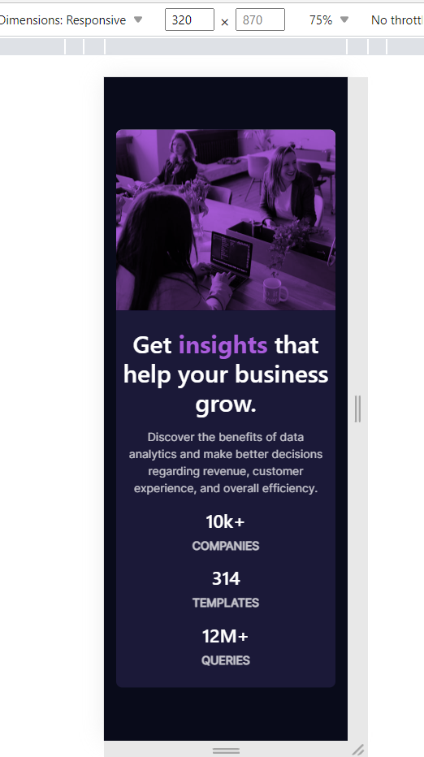

# Frontend Mentor - Stats preview card component solution

This is a solution to the [Stats preview card component challenge on Frontend Mentor](https://www.frontendmentor.io/challenges/stats-preview-card-component-8JqbgoU62). Frontend Mentor challenges help you improve your coding skills by building realistic projects. 

## Table of contents

- [Overview](#overview)
  - [The challenge](#the-challenge)
  - [Screenshot](#screenshot)
  - [Links](#links)
- [My process](#my-process)
  - [Built with](#built-with)
  - [What I learned](#what-i-learned)
  - [Useful resources](#useful-resources)
- [Author](#author)

## Overview

### The challenge

The challenge was to reach as close to the design given by Frontend Mentor And..

Users should be able to:

- View the optimal layout depending on their device's screen size

### Screenshot

### Links

- Solution URL: [solution code](https://github.com/Gautambudh/stats-preview-card-component.git)
- Live Site URL: [page](https://gautambudh.github.io/stats-preview-card-component/)

## My process

### Built with

- Semantic HTML5 markup
- CSS custom properties
- Bootstrap (grid sysytem)

### What I learned

I learnt to highlight a specific word in paragraph and how to give an overlay on an image. Also i applied
mix-blend-mode:multiply; to beautifully blend the overlay on image.Further i'm looking to add more stuff in it in future.

### Useful resources
**w3schools helped me a lot in getting familiar with lots of CSS properties and while working with Bootstrap5**

## Author

- Frontend Mentor - [@Gautambudh](https://www.frontendmentor.io/profile/Gautambudh)

